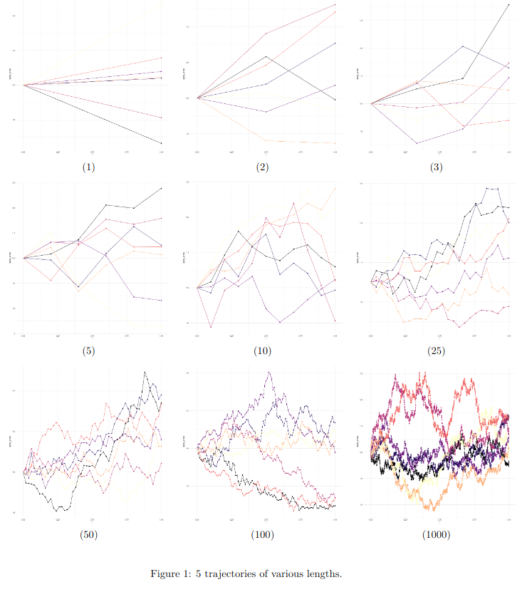

# Application of Monte Carlo to Financial Models




## Google Colab

We can clone and build this project using Google Colab.

[Here's](https://colab.research.google.com/drive/12m_zUVkCvZ4R089stzDmpC4NUihoRZOy?usp=sharing) a link to the notebook.

## New Colab

You can run the following code blocks in a new Google Colab notebook if you want to build the project from scratch.

Clone
```bash
!git clone https://github.com/amauryrlm/Monte-Carlo-Project-CUDA.git -b trajectories \
  && chmod +x ./Monte-Carlo-Project-CUDA/colab_build.sh \
  && chmod +x ./Monte-Carlo-Project-CUDA/colab_run.sh
```

Build
```bash
!./Monte-Carlo-Project-CUDA/colab_build.sh
```

Run
```bash
!./Monte-Carlo-Project-CUDA/colab_run.sh
```